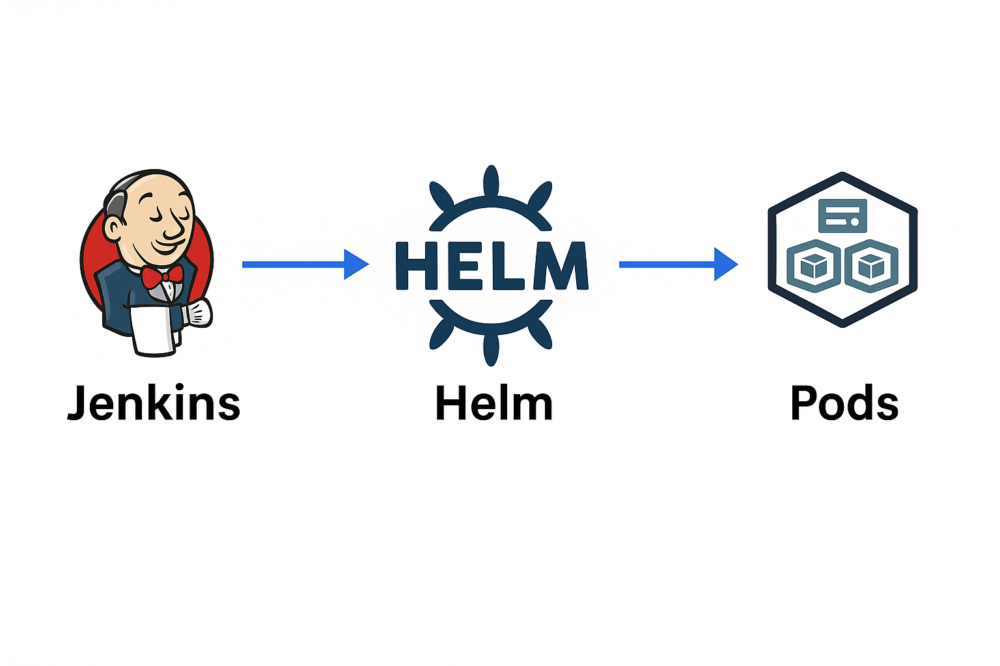

# 🧰 Microservices CI/CD on Kubernetes (Minikube + Helm + Jenkins)

This project demonstrates a complete microservices pipeline using:
- Flask-based `web` and `auth` services
- PostgreSQL backend
- Docker + Helm deployments on Minikube
- Jenkins CI/CD integration

## 🚀 Architecture
- `web`: Calls `auth` service and displays health
- `auth`: Responds with `Auth OK`
- `db`: Postgres initialized via Helm
- Kubernetes handles internal service discovery
- Jenkins automates the Docker → Helm deploy pipeline

## 🖼 Architecture Diagram




## 🗂 Directory Structure
```
.
├── web/                  # Flask frontend
├── auth/                 # Flask backend
├── db/init.sql           # DB setup
├── helm-chart/           # Helm deployments
├── docker-compose.yml    # Optional for local dev
├── Jenkinsfile           # CI/CD pipeline
├── deploy.sh             # Automation script
└── README.md             # This file
```

## 🥪 To Run Locally
```bash
eval $(minikube -p minikube docker-env)
docker build -t web:latest ./web
docker build -t auth:latest ./auth
helm upgrade --install devstack ./helm-chart -n dev --create-namespace
kubectl port-forward svc/web 8080:80 -n dev
```

Then open: [http://localhost:8080](http://localhost:8080)

## ✅ Expected Output
```
Web frontend working. Auth says: Auth OK
```

## ⚙️ Jenkins Pipeline Overview
- **Build Stage**: Builds Docker images for `web` and `auth`
- **Deploy Stage**: Deploys all components using Helm to the `dev` namespace
- **Visual View**: See full pipeline in Jenkins classic UI or Blue Ocean

## 📆 Tech Stack
- Python 3.10 (Flask)
- Docker & Docker Compose
- Kubernetes (Minikube)
- Helm 3.x
- Jenkins CI (classic UI)

---

Maintained by: **Raghavendra S.**

